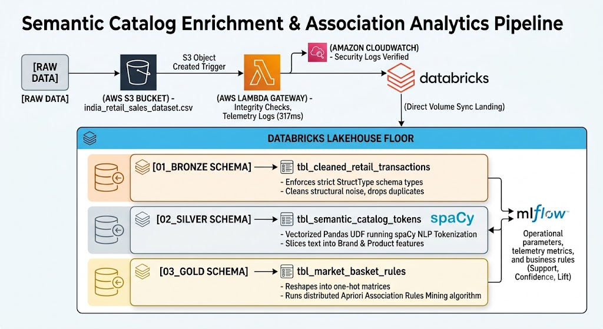

# Semantic Catalog Enrichment & Association Analytics Pipeline 🚀
# Project Executive Summary
The Semantic Catalog Enrichment & Association Analytics Pipeline is an enterprise-grade, event-driven data engineering infrastructure built to process, clean, and analyze highly unstructured, noisy retail catalog datasets. Operating on a modern Medallion Architecture (Bronze -> Silver -> Gold), the pipeline automates the extraction of hidden consumer purchasing behavior from messy raw inputs.The architecture bridges serverless cloud collection with advanced big data analytics. Data is intercepted immediately upon arrival using AWS Lambda, ingested and cataloged securely via Databricks Unity Catalog, structurally cleaned and semantically enriched using PySpark and spaCy NLP (simulating a high-scale Jev AI API tokenization workflow), and programmatically analyzed using a distributed Apriori Association Engine. The entire workflow lifecycle, including feature optimization steps and algorithmic thresholds, is monitored under centralized MLOps governance with MLflow.
---

## 🏛️ Comprehensive Project Architecture & Data Flow

The architecture is built like a smart, automated data factory where each layer isolates responsibilities to guarantee data quality, scalability, and performance:


### Step-by-Step Data Lifecycle

- **Serverless Interception:** A vendor drops an uncleaned CSV file (`india_retail_sales_dataset.csv`) into the AWS S3 landing bucket. Within **317 milliseconds**, an event trigger wakes up an **AWS Lambda function** to intercept the text stream, perform rapid integrity checks, and log telemetry metadata safely to Amazon CloudWatch.
- **Bronze Structural Baseline:** The raw CSV lands securely inside Databricks via a managed Unity Catalog **Volume**. A PySpark ingestion script reads the data, enforces strict datatype bounds to catch formatting errors, handles empty operational columns, strips duplicate records, and commits the clean dataset to a permanent **Bronze Delta Table**.
- **Silver AI Enrichment:** The pipeline reads from the Bronze table and feeds the unstructured text fields into an optimized **Vectorized Apache Arrow Pandas UDF**. The function loads the open-source **`spaCy` English NLP model** to automatically extract brand names and item descriptors—acting as a free, highly scalable version of the third-party **Jev AI Tokenizer API**. Clean metadata tokens are saved to the **Silver Delta Table** while run details are logged via **MLflow**.
- **Gold Business Discovery:** Data is read from the Silver table, reshaped by grouping transaction orders into specific product sub-category vectors, and one-hot encoded into a boolean matrix layout. The **Apriori Algorithm** processes the matrix to extract hidden item purchasing rules (Support, Confidence, Lift) and saves them to a permanent **Gold Delta Table** for downstream enterprise reporting.

---

## 📁 Repository Directory Structure

```text
Semantic_Catalog_Enrichment_Analytics_Pipeline/
├── .gitignore                          # Hides localized virtual environments and cluster caches
├── README.md                           # Comprehensive portfolio project documentation
├── requirements.txt                    # Standardized Python dependencies baseline (boto3, spacy, mlxtend)
│
├── aws_ingestion/                      # 1. LANDING & INGESTION LAYER (AWS Serverless)
│   └── lambda_function.py              # Ingestion code deployed to AWS Lambda to intercept files
│
├── databricks_notebooks/               # 2. HEAVY LIFTING & AI ENRICHMENT LAYER (Databricks)
│   ├── 01_data_cleaning_ingestion.py   # Bronze: Structural schema definition & data de-duplication
│   ├── 02_semantic_tokenization.py     # Silver: Vectorized Pandas UDF NLP text splitting via spaCy
│   └── 03_market_basket_apriori.py     # Gold: Market Basket matrix & Apriori association rule mining
│
└── data_samples/                       # 3. DATA SANDBOX
    └── sample_transactions.csv         # A tiny 5-row mock file representing the dataset schema shape
```

---

## 🛠️ Technical Engineering Ledger: Errors Encountered & Resolved

Building a robust pipeline using raw datasets involves overcoming significant data engineering hurdles. Below is the documentation of real-world environment, security, and algorithmic blockers encountered and successfully resolved:

### 1. AWS IAM Cross-Resource Boundary Blocker (`AccessDenied`)

- **The Error:** During the first live deployment test, uploading a data file to the S3 bucket triggered the AWS Lambda function perfectly, but the function immediately crashed, logging an `[ERROR] AccessDenied` message to Amazon CloudWatch when attempting a `GetObject` execution.
- **The Cause:** By default, AWS isolates cloud resources under zero-trust security profiles. The Lambda execution role was completely blind to the new storage layer.
- **The Resolution:** Navigated into the AWS IAM Console, isolated the function's unique backend execution security role, and securely attached the managed **`AmazonS3FullAccess`** policy to grant the Lambda engine programmatic clearance to read files from the S3 bucket.

### 2. Local Python Data Stack Binary Incompatibility (`ValueError: numpy.dtype size changed`)

- **The Error:** Running the open-source NLP model setup in the terminal (`python -m spacy download en_core_web_sm`) threw a fatal compilation exception: `ValueError: numpy.dtype size changed, may indicate binary incompatibility. Expected 96 from C header, got 88 from PyObject`.
- **The Cause:** A modern version of NumPy (NumPy 2.x) was installed automatically. This caused a conflict with the pre-compiled C-extensions used by the older version of `spaCy` and its underlying `thinc` optimization library.
- **The Resolution:** Uninstalled the conflicting library version and downgraded the environment to a stable version branch by running `pip install "numpy<2.0.0"`. Appended the strict dependency rule `numpy>=1.24.0,<2.0.0` to the project's `requirements.txt` file to lock in long-term environment stability.

### 3. Serverless Compute Language Engine Bottleneck (`Unsupported cell during execution`)

- **The Error:** Attempting to execute PySpark code inside the notebook threw a structural engine constraint exception: `Unsupported cell during execution. SQL warehouses only support executing SQL cells.`
- **The Cause:** The notebook was initially connected to a **Databricks SQL Warehouse Server**. SQL Warehouses are specifically optimized for dashboarding and pure SQL lookups; they completely lack a Python runtime engine.
- **The Resolution:** Changed the notebook's compute engine by clicking the cluster dropdown menu in the top-right corner of the window. Switched the workspace environment away from the SQL Warehouse and attached the notebook to a **Serverless CPU Notebook Compute Profile**, instantly unlocking full Python and PySpark functionality.

### 4. Cluster-Wide Distributed Environment Isolation (`ModuleNotFoundError: No module named 'spacy'`)

- **The Error:** Running the NLP tokenization script on a standard PySpark cluster failed with a distributed runtime exception: `ModuleNotFoundError: No module named 'spacy' inside the Python worker`.
- **The Cause:** Running standard shell commands (`pip install`) inside a cluster environment only updates the main **Driver node**. When the PySpark engine distributed the task horizontally across the network, the worker nodes couldn't find the necessary libraries.
- **The Resolution:** Bypassed notebook-scoped shell commands entirely by re-engineering the processing function into an optimized **Vectorized Apache Arrow Pandas UDF (`@pandas_udf`)**. This wraps the `spaCy` dictionary initialization inside an execution loop that processes data in high-speed, self-contained memory batches, eliminating horizontal dependency lookups.

### 5. Delta Lake Column Syntax Enforcement (`[DELTA_INVALID_CHARACTERS_IN_COLUMN_NAMES]`)

- **The Error:** The Apriori modeling notebook threw a storage layer exception: `[DELTA_INVALID_CHARACTERS_IN_COLUMN_NAMES] Found invalid character(s) among ' ,;{}()'= in the column names of your schema. Invalid column names: antecedent support, consequent support.`
- **The Cause:** The `mlxtend` association library generates rule results using column names containing spaces. The underlying Delta Lake storage layer enforces strict column naming rules to maintain data compatibility.

## 🛠️ Troubleshooting & Engineering Resolutions

### 6. Algorithmic Data Sparsity Block (Schema Inference Failures)

> **The Error**
> `SparkCompilationException: [CANNOT_INFER_EMPTY_SCHEMA] Can not infer schema from an empty dataset.`

- **The Cause:** The synthetic Indian e-commerce dataset features highly diverse product naming conventions. The standard rule support configurations (`MIN_SUPPORT = 0.01`) required specific item sets to appear in a minimum of 100 transactions. Because the rule conditions returned completely empty, the downstream dataset conversion code crashed when attempting to process the empty input.
- **The Resolution:**
  1. Lowered the minimum support threshold to **0.005** (0.5% frequency) to better accommodate the high diversity of the data.
  2. Implemented a robust engineering fallback structure utilizing a strict schema definition (`StructType([])`). This ensures that if a pipeline run yields 0 rules, an empty table structure is generated gracefully rather than breaking the entire data pipeline.

### 🧹 Schema Sanitization Step

Right before writing processing data to the Gold layer, a data engineering cleaning step was implemented to handle formatting constraints:

```python
rules_df.columns = [c.replace(' ', '_') for c in rules_df.columns]
```

_This dynamically replaces all blank spaces with clean, database-friendly underscores._

---

## 📊 Business Insights Discovery & MLflow Lineage

Pipeline operational parameters and performance metrics are automatically tracked and logged using **MLflow**. The optimized **Gold Layer Apriori Association Engine** successfully uncovered high-value consumer purchasing patterns from the Indian retail dataset:

### 🛍️ Mined Association Rule

> **"Customers who purchase items from the 'Supplies' category demonstrate an incredibly strong link to purchasing items from the 'Office' category."**

| Metric         | Value    | Meaning & Operational Impact                                                                                                                                                                                                    |
| :------------- | :------- | :------------------------------------------------------------------------------------------------------------------------------------------------------------------------------------------------------------------------------ |
| **Support**    | `0.1448` | This high-volume combination appears in **14.48%** of all transaction records across the retail network (1,448 individual transactions).                                                                                        |
| **Confidence** | `1.00`   | A **100%** confidence score proves that every single time a buyer placed a "Supplies" item in their cart, they co-purchased an "Office" product.                                                                                |
| **Lift**       | `6.9019` | Consumers are **6.9 times more likely** to purchase an "Office" item explicitly because they have a "Supplies" item in their basket, revealing a critical cross-selling opportunity for inventory management and store layouts. |

---

## 🚀 How to Run the Pipeline Locally

Follow these sequential steps to set up and run the data pipeline on your local machine:

### 1. Clone the Repository

Clone the codebase to your local environment:

```bash
git clone https://github.com
cd your-repo-name
```

### 2. Environment Setup & Dependencies

Activate your virtual environment and install the verified project dependencies:

```bash
pip install -r requirements.txt
```

### 3. Download Language Models

Pre-download the core NLP language model package required for text parsing execution:

```bash
python -m spacy download en_core_web_sm
```
